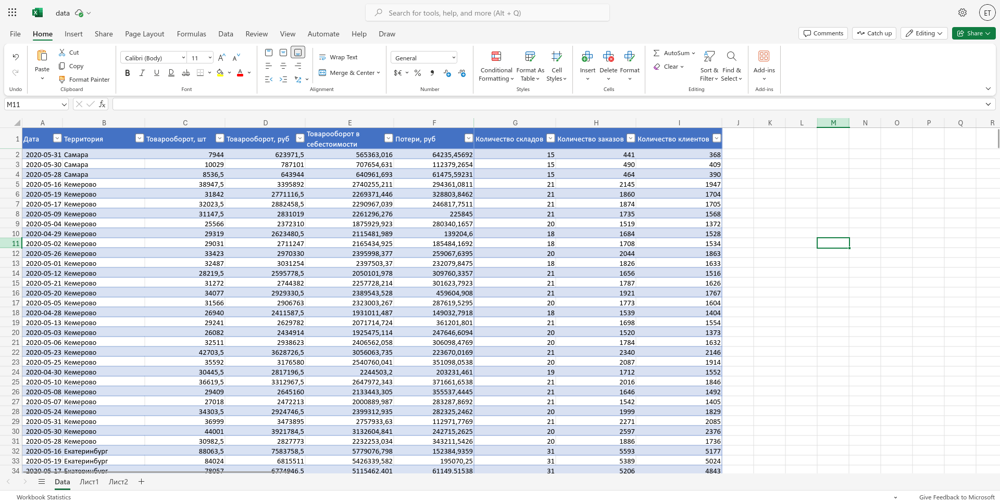

#### Task 1
1. **Creating Named Tables**:  
   Named tables were created in each sheet for easy reference:
   - **Table1** in *List1*
   - **Table2** in *List2*

2. **Creating an Index Column**:  
   An index column was created in each table using a combination of the **Дата** (Date) and **Территория** (Territory) columns to form a unique key. This index was used as the primary key for matching rows across the two tables.

   Formula for Index (in both tables):
   ```excel
   =@[Дата] & @[Территория]
   ```

3. **Creating the Data Sheet**:  
   A new sheet, **Data**, was created to consolidate the data:
   - Data from **List1** (Table1) was copied into this sheet.
   - The columns **Количество складов**, **Количество заказов**, and **Количество клиентов** were filled by matching data from **Table2** using the index column.

4. **Filling Additional Columns with XLOOKUP**:  
   The following `XLOOKUP` formulas were used to pull data from **Table2** based on the index key:
   
   ```excel
   =XLOOKUP(Table1[@index]; Table2[index]; Table2[Количество складов]; 0)
   =XLOOKUP(Table1[@index]; Table2[index]; Table2[Количество заказов]; 0)
   =XLOOKUP(Table1[@index]; Table2[index]; Table2[Количество клиентов]; 0)
   ```

5. **Result**:  
   A consolidated table was created in the **Data** sheet, merging data from **List1** and **List2** based on the shared index.
   
