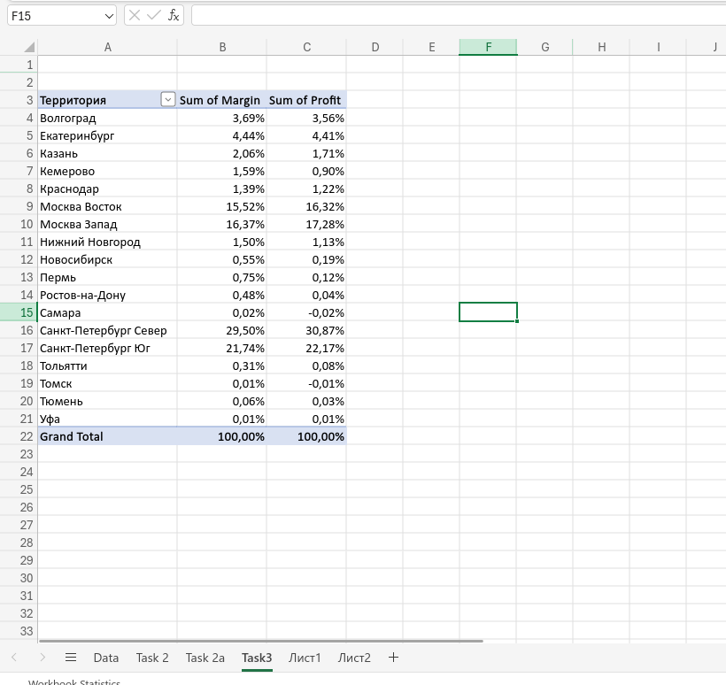
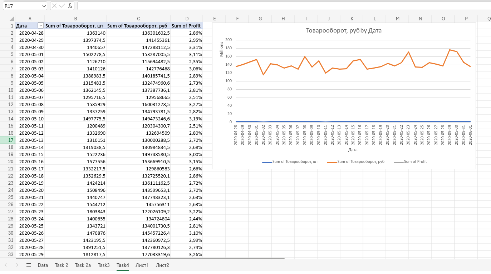

#### Task 1
1. **Creating Named Tables**:  
   Named tables were created in each sheet for easy reference:
   - **Table1** in *List1*
   - **Table2** in *List2*

2. **Creating an Index Column**:  
   An index column was created in each table using a combination of the **Дата** (Date) and **Территория** (Territory) columns to form a unique key. This index was used as the primary key for matching rows across the two tables.

   Formula for Index (in both tables):
   ```excel
   =@[Дата] & @[Территория]
   ```

3. **Creating the Data Sheet**:  
   A new sheet, **Data**, was created to consolidate the data:
   - Data from **List1** (Table1) was copied into this sheet.
   - The columns **Количество складов**, **Количество заказов**, and **Количество клиентов** were filled by matching data from **Table2** using the index column.

4. **Filling Additional Columns with XLOOKUP**:  
   The following `XLOOKUP` formulas were used to pull data from **Table2** based on the index key:
   
   ```excel
   =XLOOKUP(Table1[@index]; Table2[index]; Table2[Количество складов]; 0)
   =XLOOKUP(Table1[@index]; Table2[index]; Table2[Количество заказов]; 0)
   =XLOOKUP(Table1[@index]; Table2[index]; Table2[Количество клиентов]; 0)
   ```

5. **Result**:  
   A consolidated table was created in the **Data** sheet, merging data from **List1** and **List2** based on the shared index.
   


#### Task 2
Using the consolidated data from the Data sheet, a summary table was created to analyze data by **Week** and **Territory**.

1. **Adding a Week Column**:  
   A new column, **Week**, was created to identify the week number of each date. The following formula was used:
   ```excel
   =WEEKNUM(@[Дата])
   ```

2. **Creating the Pivot Table**:  
   A Pivot Table was generated from the Master data table to provide a weekly summary by territory:
   - **Rows**: The fields **Week** and **Территория** were added to the row labels to break down data by both week and territory.
   - **Values**: The fields **Количество складов**, **Количество заказов**, and **Количество клиентов** were added as values to aggregate counts per week and territory.

3. **Result**:  
   The resulting Pivot Table, named **Task 2**, displays the summary of key metrics (number of warehouses, orders, and clients) organized by week and territory.
   

Here's a concise Markdown summary for **Task 2a**:


### Task 2a

The objective of this task was to find the top 3 territories based on total turnover and turnover per warehouse for the last week.

1. **Calculating Turnover**:  
   A new column, **Turnover**, was created to calculate the turnover by subtracting the **Товарооборот в себестоимости** (cost turnover) from the **Товарооборот, руб** (revenue turnover). The formula used was:
   ```excel
   =[@[Товарооборот, руб]] - [@[Товарооборот в себестоимости]]
   ```

2. **Top 3 Territories by Share in Total Turnover**:  
   A Pivot Table was created on the Data table with the following steps:
   - **Rows**: Added **Территория** (territory) to rows.
   - **Values**: Added **Turnover** and summarized by **SUM**.
   - **Sorting**: Sorted territories by **Sum of Turnover** in descending order.
   - **Filtering**: Filtered the territories to show the top 3 based on **Sum of Turnover**.
   - **Percentage View**: Changed the territory view to show percentages of the grand total for turnover.

3. **Top 3 Territories by Turnover to Warehouse for the Last Week**:  
   A second Pivot Table was created with the following steps:
   - **Rows**: Added **Территория** (territory) to rows.
   - **Values**: Added **Turnover** and summarized by **SUM**.
   - **Filters**: Added **Week** to filters and selected **Week 23**, which corresponds to the latest week.
   - **Filtering**: Filtered the territories to show the top 3 based on **Sum of Turnover** for **Week 23**.

4. **Results:**
   The top 3 territories by share in total turnover and by turnover per warehouse for Week 23 were successfully identified and presented in the following Pivot Tables.
   


#### Task 3
Calculating the Margin and Profitability in % of Turnover in All Territories

1. **Calculating Profit and Margin**:
   - **Profit**: The formula for calculating profit is:
     ```excel
     =[@[Товарооборот, руб]] - [@[Товарооборот в себестоимости]] - [@[Потери, руб]]
     ```
     This formula subtracts the cost turnover and losses from the total revenue to determine the profit.
     
   - **Margin**: The formula for margin is:
     ```excel
     =[@[Товарооборот, руб]] - [@[Товарооборот в себестоимости]]
     ```
     This calculates the margin by subtracting the cost turnover from the total revenue.

2. **Creating the Pivot Table**:
   A Pivot Table was created with the following structure:
   - **Rows**: Added **Территория** (territory) to the rows to group the data by territories.
   - **Values**: Added **Sum of Margin** and **Sum of Profit** to the values section.
   - **Percentage View**: Both **Margin** and **Profit** were changed to display as percentages of the Grand Total. This allows for an understanding of the relative margin and profit per territory.

3. **Results:**
   Margin and Profitability in % of Turnover in All Territories.
   


#### Task 4
Creating a Schedule with the Daily Dynamics of Turnover and Profitability in % for All Territories

1. **Pivot Table Creation**:
   A new Pivot Table was created to track the daily dynamics of turnover and profitability across all territories:
   - **Rows**: Added **Дата** (Date) to the rows to analyze daily data.
   - **Values**: Added the following values:
     - **Sum of Товарооборот, шт** (Quantity of turnover items)
     - **Sum of Товарооборот, руб** (Revenue turnover)
     - **Sum of Profit**
   - **Profit as Percentage**: The **Sum of Profit** was set to show as a percentage of the Grand Total, representing profitability for each day relative to the total.

2. **Line Chart Creation**:
   A line chart was created to visualize the data:
   - **X-Axis**: **Дата** (Date) was used as the X-axis to show the time period.
   - **Y-Axis**: **Sum of Товарооборот, руб** (Revenue turnover) was plotted to visualize daily turnover trends.
   - **Chart Type**: A line chart was used to clearly display daily dynamics of turnover over time.

3. **Results:**
   a Schedule with the Daily Dynamics of Turnover and Profitability in % for All Territories
   


